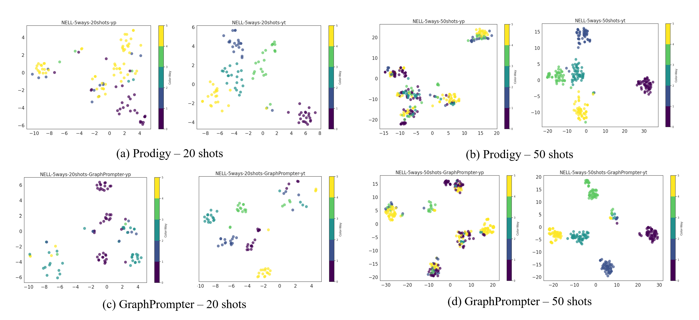

# GraphPrompter: Empowering Graph In-Context Learning with Adaptive Prompt Optimization

A multi-stage adaptive graph prompt selection algotithm to enhance the in-context learning over graphs.

<!--  -->


# Setup

```
pip install -r requirements.txt
pip install pyg_lib torch_scatter torch_sparse torch_cluster -f https://data.pyg.org/whl/torch-2.0.1+cu117.html

```

All datasets should be prepared to individual folders under <DATA_ROOT>. For MAG and arXiv, the datasets will be automatically downloaded and processed to <DATA_ROOT>. In case of memory issue when generating adjacency matrix, we also provide the preprocessed MAG [adjacency matrix](http://snap.stanford.edu/prodigy/mag240m_adj_bi.pt) that should be put under <DATA_ROOT>/mag240m after the ogb download.

For KG, download preprocessed [Wiki](http://snap.stanford.edu/prodigy/Wiki.zip) and [FB15K-237](http://snap.stanford.edu/prodigy/FB15K-237.zip) datasets to <DATA_ROOT>. Download other KG datasets ([NELL](http://snap.stanford.edu/csr/NELL.zip) and [ConceptNet](http://snap.stanford.edu/csr/ConceptNet.zip)) similarly following links in https://github.com/snap-stanford/csr.

# Pretraining and Evaluation

pretrain on mag240m : `pretrain_mag240m.sh`

pretrain on wiki : `pretrain_wiki.sh`

> We provide pretrained model in folder `./state`, you can use these models straightly.

evaluation on arxiv: `eval_arxiv.sh`

evaluation on ConcepNet/FB15K-237/NELL: `eval_all_kg.sh`


# Rebuttal

## R.1 Background


> Fig1. Graph In-Context Learning (GICL), edge classification as an example, with random prompts selection. Given the large knowledge graph $G$, we sample thhe graph prompts with $l$-hop neighbors (left) and the downstream tasks are reformulated as the edge label predictions between the query data graph and label nodes (right).
>
Specifically, for each category, we randomly choose $k$ samples to constitute the prompt, e.g., we choose the "(Robert Downey Jr., Iron Man)" and its corresponding label "film/actor" as the prompt. Firstly, we sample the $1$-hop neighbors of these two nodes to constitute the data graph, and then get its embedding through GNN aggregation. The corresponing label of these emebeddigns are connected in task graph.  The label noes are initialized by their text attributes and then updated with graph prompts. 

For each query, such as"(Cillian Murphy, Ireland)", we sample the data graphs as bove, and in task graph, we need to decided which label the query belong to, "film/actor" or "person/religion". In this stage, we calculate the similarity between query embedding and label embeddings to select the most similar label as the answer.


> Fig2. Some real examples of Graph In-context Learning. In a comprehensible sense, graph prompts and language prompts are similar. They both provide a priori knowledge to the model by feeding it some examples to guide the model to better answer the question, as this example, we select $3$ prompts for each category, the difference is in how to construct the prompts and how the model understands and utilizes them. 
>
For large language model, we can use the language words to construct prompts straightly. However, in graph domain, we need to design the new framework to construct/select/optimize prompts, to achieve the impressive in-context learning ability in graph domain.


## R.2 Futher analysis

(1) As we discussed in Section 5.4, as we increase the number of prompts, the Graph In-Context Learning models (e.g. PRODIGY[1] and our GraphPrompter) effect tends to increase and then decrease. We want to have some futher discussion about it.

**Firstly, let's illustrate this phenomenon with some examples in `Fig3` and `Fig4`:**


> Fig3. Distribution of data node embeddings with different number of shots by using PRODIGY[1]. 'yp' means the model prediction results, 'yt' means the ground truth labels. The data node embeddings denote the subgraph embeddings of sampled subgraphs, which are the output of "Data graphs" in Fig1 and the input of "Task graphs".
>

As we can see in Fig3, when the number of prompts is very small (=3), the distribution of data samples in each category is very uniform, at this time, the classification based on the similarity between samples is naturally less effective. When the number of prompts gradually increases, the clustering effect of data samples gradually improves, and clusters of clustered points can be clearly seen, but when the number of prompts is too much, for example, `shots=50`, the clustering effect of the model deteriorates, and the sample points of different labels are mixed together, which makes the perdict performance worse than `shots=20`.



> Fig4. Distribution of data node embeddings with different number of shots by using PRODIGY[1] and our GraphPrompter. 'yp' means the model prediction results, 'yt' means the ground truth labels. The data node embeddings denote the subgraph embeddings of sampled subgraphs, which are the output of "Data graphs" in Fig1 and the input of "Task graphs".

From Fig4, we can see that with the same number of prompts, e.g.`shots=20`, our GraphPrompter get the clear classification results than the baseline PRODIGY. However, based on the exsisting Graph In-Context Learning framework, our method still suffer from the problem of too many prompts, though, it is still better than baseline.


**The limitation of the exsisting Graph In-Context Learning framework is:**
As we introduce in Fig1, this framework can be divided in two part, Data graphs and Task graphs, both of them are pre-training with large datasets and fixed weights during downstream test stage. When we increasing the prompts number, the nodes of Task graphs will be increase, accroding to the limitation of model's memory, the predict performance is decreasing. 

Modifying the structure of the Task graph is a possible solution, such as expanding the capacity of the graph model or switching to another clustering method. We will continue to explore them in future work.

**Finally, even there have some limitaiosn in our method, the performance of our GraphPrompter obtain SOTA in most few-shots experiments, and we believe our work is provide a novel insights of Graph In-Context Learning.**

[1] Qian Huang, et al. PRODIGY: Enabling In-context Learning Over Graphs. (NeuraIPS 2023).
# Citations

If you use this repo, please cite the following paper. This repo reuses code from [CSR](https://github.com/snap-stanford/csr) for KG datasets loading.

```
@article{Huang2023PRODIGYEI,
  title={PRODIGY: Enabling In-context Learning Over Graphs},
  author={Qian Huang and Hongyu Ren and Peng Chen and Gregor Kr\v{z}manc and Daniel Zeng and Percy Liang and Jure Leskovec},
  journal={ArXiv},
  year={2023},
  volume={abs/2305.12600}
}
```

article(Under review):  Empowering Graph In-Context Learning with Adaptive Prompt Optimization
